# ICP CON I-7188

### Программирование контроллера

> **Цель работы**: освоение процесса программирования контроллера ICP CON I-7188.

> При возникновении проблем обратитесь к файлу [TROBLESHOOT.md](./TROBLESHOOT.md).

## Информация о тестовом стенде

В тестовом стенде используется PC-совместимый промышленный контроллер I-7188, работающий на DOS-подобной операционной системе MiniOS7. По функционалу она аналогична другим DOS системам и в ней можно запускать программы, которые исполняются в стандартном DOS.

Несмотря на то, что система команд x86 совместимая, использование DOS накладывает ограничения на выбор компиляторов. Список поддерживаемых компиляторов перечислен [на сайте производителя](http://ftp.icpdas.com/pub/cd/8000cd/Napdos/MiniOS7/Document/compiler_v1.1.pdf):

- Microsoft C 6.00 Compiler;
- Microsoft Visual C 1.50 Compiler;
- Borland C++ 3.1 IDE;
- Borland C++ 5.02 IDE;
- Turbo C 2.01 Compiler;
- Turbo C++ 1.01 Compiler.

Каждый из них был собран в 16-битном режиме и не может быть запущен в современных версиях Windows, только из-под DOSBox.

В данном методическом материале был выбран OpenWatcom 2.0 как наиболее поддерживаемый в настоящее время.

В качестве среды программирования можно использовать любой текстовый редактор или интегрированную среду разработки с поддержкой CMake. В руководстве рассмотрена бесплатная среда Visual Studio Code.

## Установка необходимого ПО

Для компиляции необходимо установить OpenWatcom v2 со страницы Releases [GitHub репозитория](https://github.com/open-watcom/open-watcom-v2/releases/tag/Current-build).

Выберите С компилятор под необходимую платформу (например, [open-watcom-2_0-c-win-x64.exe](https://github.com/open-watcom/open-watcom-v2/releases/download/Current-build/open-watcom-2_0-c-win-x64.exe)):

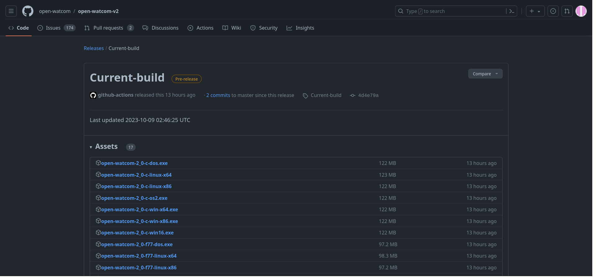

Путь установки рекомендуется оставить по умолчанию, но при необходимости есть возможность использовать другой каталог, в пути которого нет пробелов и кириллицы (см. [TROBLESHOOT.md](./TROBLESHOOT.md#другой-каталог)):

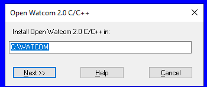

Все компоненты компилятора не требуются, выберите Selective installation:

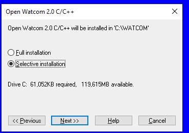

Укажите необходимые компоненты:

- `Include 16-bit compilers`;
- В окне `Target...` — `DOS`;
- В окне `Host...` — `Windows NT 64-bit(experimental)`;
- В окне `Other...` — убрать галочку с `Sample programs`.

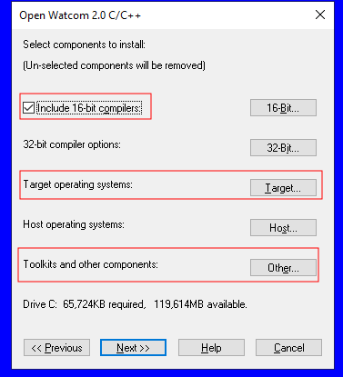

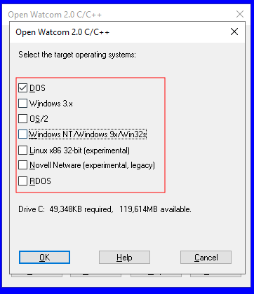

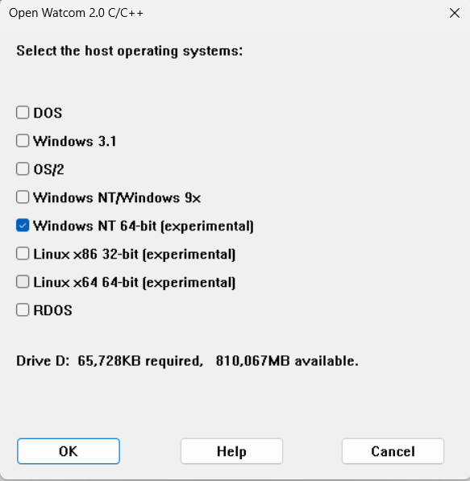

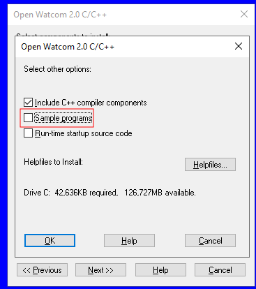

После завершения установки, выберите `Modify local machine environment variables`:

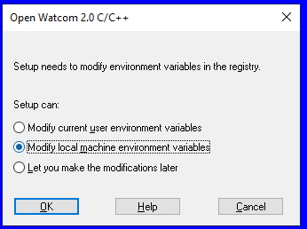

Затем `Don't modify associations`:

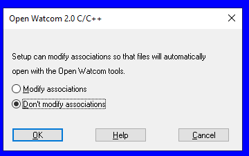

Установка компилятора завершена.

## Установка CMake

Скачайте со страницы загрузок установочный файл
[cmake-3.27.7-windows-x86_64.msi](https://github.com/Kitware/CMake/releases/download/v3.27.7/cmake-3.27.7-windows-x86_64.msi) (на момент написания текста актуальная версия - 3.27.7).

Запустите файл и выполните установку. В ходе установки выберите изменение переменной окружения PATH:

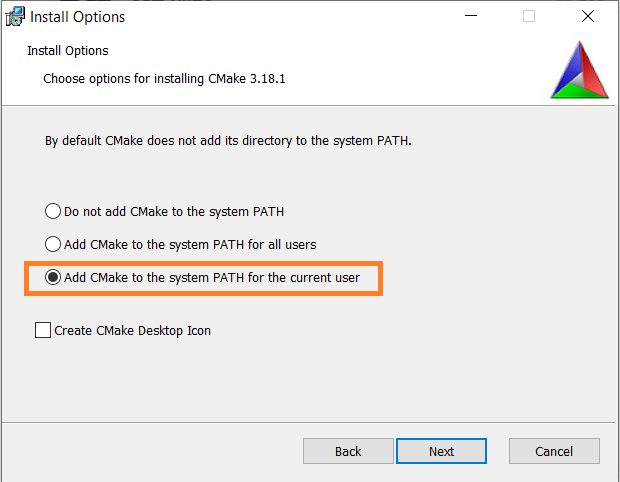

> [!IMPORTANT]
> **После установки рекомендуется произвести перезагрузку компьютера для применения изменений переменных окружения.**

Выполните в консоли команду `cmake --version` для проверки корректности установки CMake:

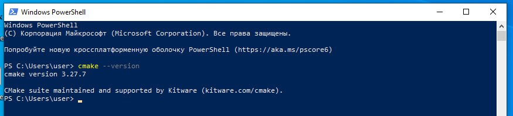

## Установка VS Code

Установка VS Code не представляет сложностей. Достаточно скачать установочный файл [со страницы загрузок](https://code.visualstudio.com/download) и запустить его.

Затем нужно установить набор необходимых плагинов для работы с C++. Для этого в поиске дополнений наберите «c++ extension» и установите C/C++ Extension Pack.

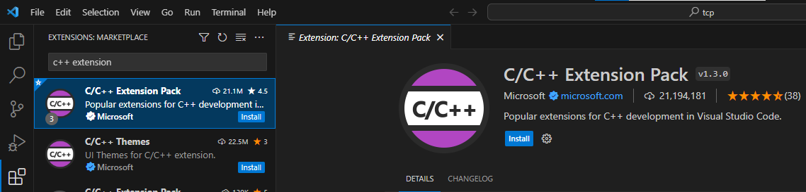

Настройка окружения завершена.

## Этапы программирования контроллера

1. Написание программы на языке C в среде программирования (Clion, VSCode) либо в Блокноте в виде простого текстового файла с расширением (.c);
2. Компиляция программы с расширением .exe с помощью системы сборки CMake;
3. Подключение контроллера к ПК по COM порту.
4. Загрузка файла программы в контроллер через специальную утилиту разработчика;
5. Запуск программы.

## Компиляция программы

1. Скачайте репозиторий с кодом и необходимыми настройками среды;
2. Загрузите проект в Visual Studio Code;
3. Перейдите во вкладку CMake;
4. В пункте Configure выберите компилятор OpenWatcom v2. Во всплывающем окне появится подсказка с каталогом компилятора;

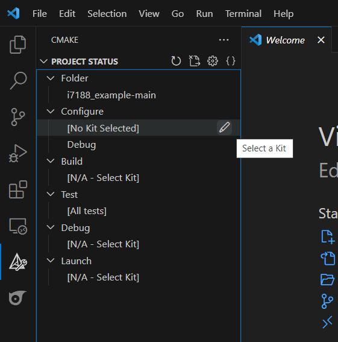
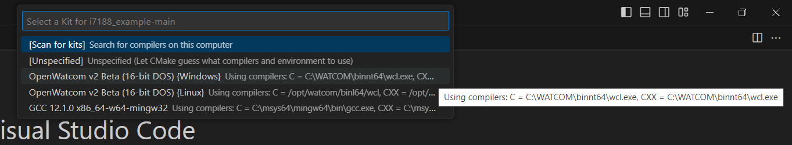

> [!NOTE]
>**Если путь компилятора не совпадает с каталогом установки, измените его, как указано в [TROBLESHOOT.md](./TROBLESHOOT.md#другой-каталог).**

5. Укажите цель сборки.

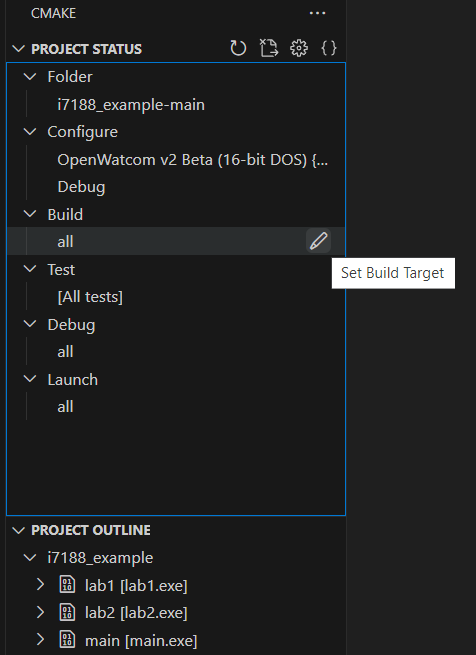
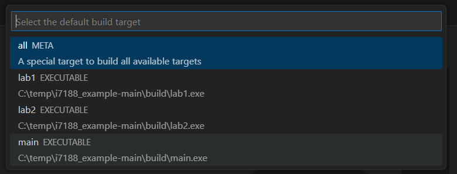

6. Выбранная цель будет отмечена значком молотка. Нажмите кнопку Build. Файл программы будет создан по пути `build/main.exe`.

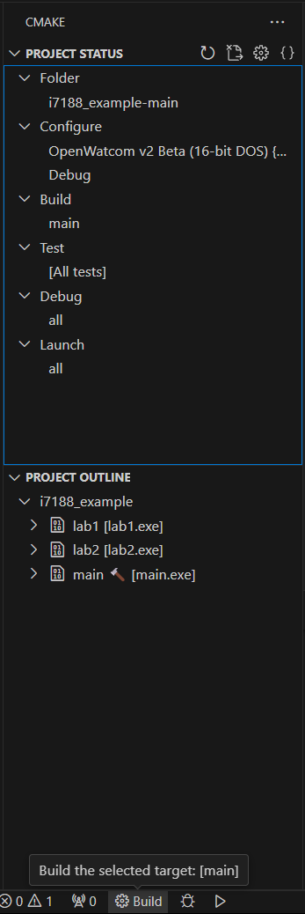

## Загрузка программы в контроллер

Для загрузки программы воспользуйтесь утилитой от производителя `7188xw.exe` 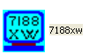.

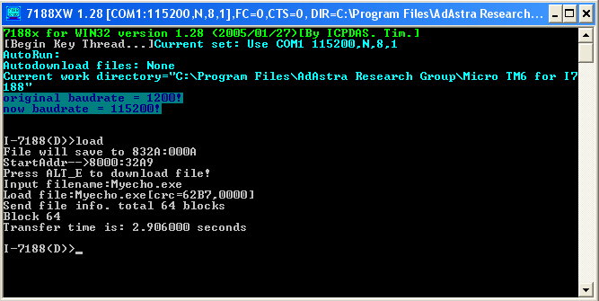

### Необходимые сочетания клавиш

- `F8` - отправка и запуск программы;
- `F2` - изменение имени файла для отправки. По умолчанию: `main.exe`;
- `Alt`+`1` - выбор номера COM-порта, где 1 соответствует `COM1`. Требуемый номер можно посмотреть в "Диспетчере устройств";
- `Alt`+`X` - сохранение настроек и выход из программы;
- `F1` - вывод справки по всем доступным командам.

## Построение графиков

Для построения графиков рекомендуется использовать программу [Serial Port Plotter](https://github.com/CieNTi/serial_port_plotter).

### Windows 7+ (64-bit)

Скачайте [последнюю версию](https://github.com/CieNTi/serial_port_plotter/releases).

Воспользуйтесь такими настройками:

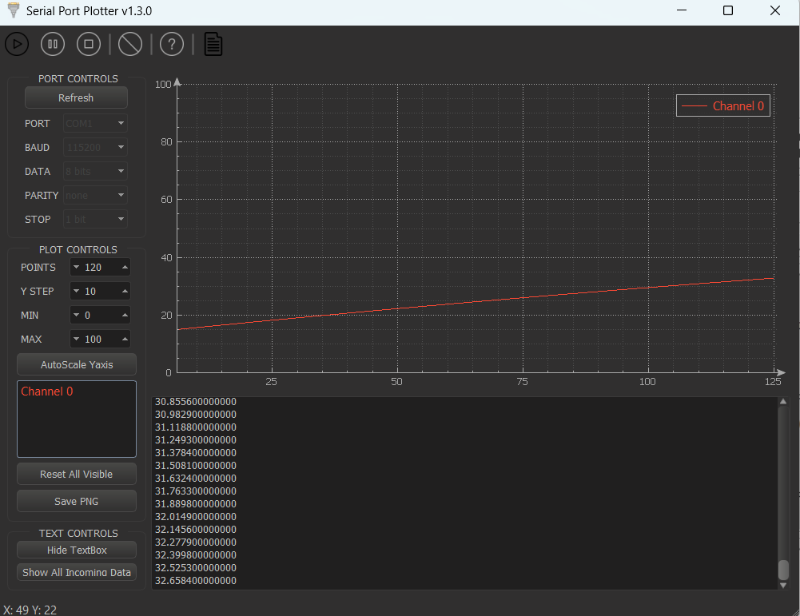

### Windows XP

Скачайте [эту](https://github.com/CieNTi/serial_port_plotter/releases/download/v1.0.0/SerialPortPlotter.exe) старую версию. К сожалению, в ней отсутствует поддержка чисел с плавающей точкой (на графике они будут отображаться как целочисленные).

Воспользуйтесь такими настройками:

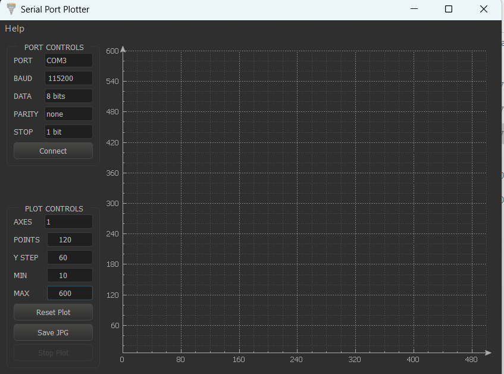