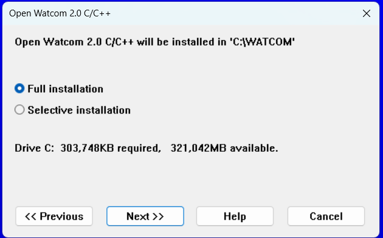

# Возможные проблемы и пути их решения

В данном документе описаны типичные проблемы, встретившиеся во время наших запусков 2 лабораторных работ. При возникновении трудностей, внимательно прочитайте этот документ.

## Проблемы с CMake

В данном пункте описаны проблемы с интеграцией между VS Code и системой сборки CMake.

### CMake не видит компилятор

#### Симптомы:
> При попытке выбора из списка CMake Kits, в нём не отображается Open Watcom 2.0:


#### Решение:
> В меню `Файл -> Открыть папку...` откройте проект на уровне вложенности, содержащем каталоги `.vscode` и `src`:


### CMake не видит цели сборки

#### Симптомы:
> В дереве проекта отображается лишь цель all или целей нет:


#### Решение:
> Запустите сборку цели all. Остальные цели должны подхватиться автоматически.

### Код возврата 1 при конфигурации проекта

#### Симптомы:
> CMake не может определить целевую платформу компилятора (ABI) и VS Code сообщает об ошибке конфигурации проекта:


> [!NOTE]
>**Решение данной проблемы найти не удалось. Open Watcom - не самый стабильный проект. Возможно, эту ошибку исправят в будущих выпусках. К счастью, данная ошибка не влияет на работоспособность компиляции и её можно игнорировать.**

## Проблемы с компилятором Open Watcom 2.0

В данном пункте описаны проблемы с установкой и проблемы, специфичные именно для компилятора.

### Другой каталог
#### Симптомы:
> При сборке, в консоли отображается следующий текст:
```
[main] Building folder: i7188_example-main 
[main] Configuring project: i7188_example-main 
[proc] Executing command: ...
[cmake] Not searching for unused variables given on the command line.
[cmake] -- The C compiler identification is unknown
[cmake] -- The CXX compiler identification is unknown
[cmake] CMake Error at CMakeLists.txt:2 (project):
[cmake]   The CMAKE_C_COMPILER:
[cmake] 
[cmake]     C:/WATCOM/binnt64/wcl.exe
[cmake] 
[cmake]   is not a full path to an existing compiler tool.
[cmake] 
[cmake]   Tell CMake where to find the compiler by setting either the environment
[cmake]   variable "CC" or the CMake cache entry CMAKE_C_COMPILER to the full path to
[cmake]   the compiler, or to the compiler name if it is in the PATH.
[cmake] 
[cmake] 
[cmake] CMake Error at CMakeLists.txt:2 (project):
[cmake]   The CMAKE_CXX_COMPILER:
[cmake] 
[cmake]     C:/WATCOM/binnt64/wcl.exe
[cmake] 
[cmake]   is not a full path to an existing compiler tool.
[cmake] 
[cmake]   Tell CMake where to find the compiler by setting either the environment
[cmake]   variable "CXX" or the CMake cache entry CMAKE_CXX_COMPILER to the full path
[cmake]   to the compiler, or to the compiler name if it is in the PATH.
[cmake] 
[cmake] 
[cmake] -- Configuring incomplete, errors occurred!
[proc] The command: ... exited with code: 1
[proc] The command: wcl failed with error: Error: spawn wcl ENOENT
[proc] The command: wcl failed with error: Error: spawn wcl ENOENT
```
#### Решение:
> Указать путь до компилятора в файлах `.vscode/c_cpp_properties.json` и `.vscode/cmake-kits.json`.

> [!NOTE]
> **В среде Windows используйте `\\` для указания пути.**

`.vscode/c_cpp_properties.json`:


`.vscode/cmake-kits.json`:


> [!NOTICE]
> **Если путь указан верно, но ошибка сохраняется, перейдите к следующему пункту.**

## Неполная установка Watcom
#### Симптомы:
> При сборке, в консоли отображается следующий текст (либо ошибка выше с `The command: wcl failed with error: Error: spawn wcl ENOENT`):
```
[main] Building folder: i7188_example-main 
[build] Starting build
[proc] Executing command: chcp
[proc] Executing command: "C:\Program Files\CMake\bin\cmake.EXE" --build c:/temp/i7188_example-main/build --config Debug --target main -j 18 --
[build] Warning: Watcom's WMake does not support parallel builds. Ignoring parallel build command line option.
[build] Open Watcom Make Version 2.0 beta Oct 10 2023 02:04:25 (64-bit)
[build] Copyright (c) 2002-2023 The Open Watcom Contributors. All Rights Reserved.
[build] Portions Copyright (c) 1988-2002 Sybase, Inc. All Rights Reserved.
[build] Source code is available under the Sybase Open Watcom Public License.
[build] See https://github.com/open-watcom/open-watcom-v2#readme for details.
[build] [ 50%] Building CXX object CMakeFiles/main.dir/src/lab2.cpp.obj
[build] [100%] Linking CXX executable main.exe
[build] Warning! W1008: cannot open plbxs.lib : No such file or directory
[build] Warning! W1008: cannot open clibs.lib : No such file or directory
[build] Error! E2028: __STK is an undefined reference
[build] Error! E2028: malloc_ is an undefined reference
[build] Error! E2028: free_ is an undefined reference
[build] Error! E2028: vsprintf_ is an undefined reference
[build] Error! E2028: __FDFS is an undefined reference
[build] Error! E2028: __FSFD is an undefined reference
[build] Error! E2028: __FDC is an undefined reference
[build] Error! E2028: _cstart_ is an undefined reference
[build] Error! E2028: _fltused_ is an undefined reference
[build] Error! E2028: __ppfltused_ is an undefined reference
[build] Error! E2028: _small_code_ is an undefined reference
[build] Error! E2028: __compiled_under_generic is an undefined reference
[build] Error! E2028: ___wcpp_4_data_init_fs_root_ is an undefined reference
[build] Error! E2028: __IsTable is an undefined reference
[build] Error! E2028: __set_ERANGE_ is an undefined reference
[build] Error! E2028: __FDN is an undefined reference
[build] Error! E2028: __HugeValue is an undefined reference
[build] Error! E2028: __I4M is an undefined reference
[build] Error! E2028: __I4D is an undefined reference
[build] Error! E2028: FPOverFlow is an undefined reference
[build] Error! E2028: FPDivZero is an undefined reference
[build] Error! E2028: FPInvalidOp is an undefined reference
[build] Warning! W1014: stack segment not found
[build] Warning! W1023: no starting address found, using 0000:0000
[build] Error(E42): Last command making (main.exe) returned a bad status
[build] Error(E02): Make execution terminated
[build] Error(E42): Last command making (CMakeFiles\main.dir\all) returned a bad status
[build] Error(E02): Make execution terminated
[build] Error(E42): Last command making (CMakeFiles\main.dir\rule) returned a bad status
[build] Error(E02): Make execution terminated
[build] file CMakeFiles\main.dir\src\lab2.cpp.obj(C:\temp\i7188_example-main\src\lab2.cpp): undefined symbol __STK
[build] file CMakeFiles\main.dir\src\lab2.cpp.obj(C:\temp\i7188_example-main\src\lab2.cpp): undefined symbol malloc_
[build] file CMakeFiles\main.dir\src\lab2.cpp.obj(C:\temp\i7188_example-main\src\lab2.cpp): undefined symbol free_
[build] file CMakeFiles\main.dir\src\lab2.cpp.obj(C:\temp\i7188_example-main\src\lab2.cpp): undefined symbol vsprintf_
[build] file CMakeFiles\main.dir\src\lab2.cpp.obj(C:\temp\i7188_example-main\src\lab2.cpp): undefined symbol __FDFS
[build] file CMakeFiles\main.dir\src\lab2.cpp.obj(C:\temp\i7188_example-main\src\lab2.cpp): undefined symbol __FSFD
[build] file CMakeFiles\main.dir\src\lab2.cpp.obj(C:\temp\i7188_example-main\src\lab2.cpp): undefined symbol __FDC
[build] file maths.lib(strtod.c): undefined symbol __IsTable
[build] file maths.lib(strtod.c): undefined symbol __set_ERANGE_
[build] file maths.lib(strtod.c): undefined symbol __FDN
[build] file maths.lib(strtod.c): undefined symbol __HugeValue
[build] file maths.lib(ldcvt.c): undefined symbol __I4M
[build] file maths.lib(ldcvt.c): undefined symbol __I4D
[build] file maths.lib(ldfd086.asm): undefined symbol FPOverFlow
[build] file maths.lib(fldd086.asm): undefined symbol FPInvalidOp
[build] file maths.lib(fldd086.asm): undefined symbol FPDivZero
[build] Error(E42): Last command making (main) returned a bad status
[build] Error(E02): Make execution terminated
[proc] The command: "C:\Program Files\CMake\bin\cmake.EXE" --build c:/temp/i7188_example-main/build --config Debug --target main -j 18 -- exited with code: 2
[driver] Build completed: 00:00:00.765
[build] Build finished with exit code 2
```

#### Решение:
> Убедитесь в существовании указанных ниже каталогов и в том, что они не пусты. Путь выберите соответственно месту вашей установки.
> - `C:\WATCOM\binnt64`
> - `C:\WATCOM\lib286\dos`

В случае отстутствия необходимых файлов, повторите установку с параметром `Full installation`, указав тот же каталог:




### Кириллица
#### Симптомы:
> При сборке, в консоли отображается следующий текст:

```
[main] Building folder: i7188_example-main main
[build] Starting build
[proc] Executing command: "C:\Program Files\CMake\bin\cmake.EXE" --build c:/Users/ЯРусский/Desktop/i7188_example-main/i7188_example-main/build --config Debug --target main -j 18 --
[build] Warning: Watcom's WMake does not support parallel builds. Ignoring parallel build command line option.
[build] Open Watcom Make Version 2.0 beta Oct 10 2023 02:04:25 (64-bit)
[build] Copyright (c) 2002-2023 The Open Watcom Contributors. All Rights Reserved.
[build] Portions Copyright (c) 1988-2002 Sybase, Inc. All Rights Reserved.
[build] Source code is available under the Sybase Open Watcom Public License.
[build] See https://github.com/open-watcom/open-watcom-v2#readme for details.
[build] CMakeFiles\main.dir\build.make(61): Warning(W18): Unrecognized or out of place character 'Г'
[build] CMakeFiles\main.dir\build.make(61): Warning(W18): Unrecognized or out of place character '║'
[build] CMakeFiles\main.dir\build.make(82): Warning(W18): Unrecognized or out of place character 'Г'
[build] CMakeFiles\main.dir\build.make(82): Warning(W18): Unrecognized or out of place character '║'
[build] CMake Error: Target DependInfo.cmake file not found
[build] CMakeFiles\main.dir\build.make(61): Warning(W18): Unrecognized or out of place character 'Г'
[build] CMakeFiles\main.dir\build.make(61): Warning(W18): Unrecognized or out of place character '║'
[build] CMakeFiles\main.dir\build.make(82): Warning(W18): Unrecognized or out of place character 'Г'
[build] CMakeFiles\main.dir\build.make(82): Warning(W18): Unrecognized or out of place character '║'
[build] Error(F38): (C:\Users\╨п╨а╤) does not exist and cannot be made from existing files
[build] Error(E02): Make execution terminated
[build] Error(E42): Last command making (CMakeFiles\main.dir\all) returned a bad status
[build] Error(E02): Make execution terminated
[build] Error(E42): Last command making (CMakeFiles\main.dir\rule) returned a bad status
[build] Error(E02): Make execution terminated
[build] Error(E42): Last command making (main) returned a bad status
[build] Error(E02): Make execution terminated
[proc] The command: "C:\Program Files\CMake\bin\cmake.EXE" --build c:/Users/ЯРусский/Desktop/i7188_example-main/i7188_example-main/build --config Debug --target main -j 18 -- exited with code: 2
[driver] Build completed: 00:00:00.269
[build] Build finished with exit code 2
```

#### Решение:
> Переместить проект в каталог без кириллических знаков в пути (например, в каталог `C:\`).

## Проблемы с I-7188

### Переполнение внутренней памяти (Not enough memory for..)

#### Симптомы:
> Программы запускаются и не зависают, но алгоритм их работы всегда один и тот же.

#### Решение:
> Очистите память при помощи команды `del *.*`. Нажмите `y` и `Enter` для подтверждения ваших намерений.


### I-7188 зависает с ошибкой [Dummy ISR]CS:IP=03D7

#### Симптомы:
> При прошивке контроллера кодом 2-ой лабораторной работы, I-7188 зависает с ошибкой [Dummy ISR]CS:IP=03D7.


#### Решение:
> Убедиться, что поддержка чисел с плавающей точкой включена в опциях компилятора. В файле `CMakeLists.txt`, в строке `add_compile_options(...)` должен быть указан ключ `-fpc`.

Пример полной команды:
```CMake
add_compile_options(-1 -bt=dos -d0 -ei -j -ms -bcl=dos -fpc)
```

## Проблемы с Turbo C и другими компиляторами

> [!NOTICE]
>**В вариантах для лабораторных работ для сборки проектов для стенда использовался компилятор Turbo C. Однако, из-за их неудобства и морального устаревания, его использование не рекомендуется (разве что в случае тотальной неудачи с компилятором OpenWatcom).**

В данном пункте описаны проблемы на примере Turbo C. Возможно, подобные проблемы будут возникать и в других компиляторах.

#### Симптомы:
> `FIDRQQ`, `FIWRQQ`, `_fltused_` не определены.

#### Решение:
> Включите поддержку эмуляции чисел с плавающей точкой в настройках компилятора.


> [!NOTE]
> **При столкновении с проблемами, которые не упомянуты в этом документе, откройте Issue или дополните этот документ, сформировав Pull Request.**